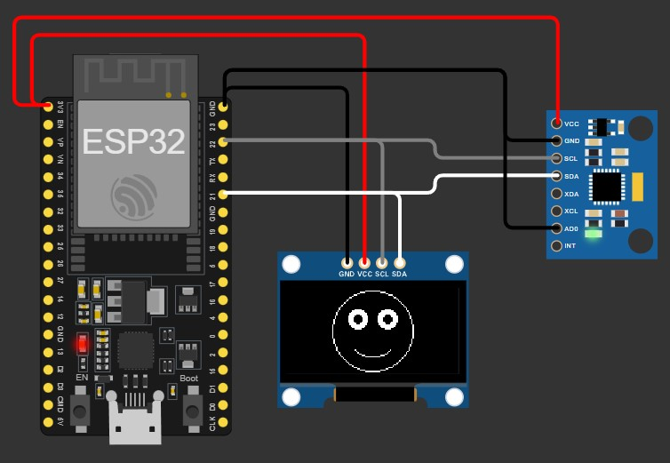

## Descrição do Projeto

Este projeto consiste na implementação de uma interface gráfica simples em um display OLED controlado por um microcontrolador ESP32, com interação baseada em movimento utilizando um sensor inercial MPU-6050.

O sistema exibe um rosto estilizado composto por olhos e um sorriso. A posição dos olhos é dinamicamente ajustada de acordo com os dados de orientação detectados pelo sensor MPU-6050, permitindo uma interação visual responsiva ao movimento físico do dispositivo. Além disso, o sistema implementa um comportamento de piscada automática dos olhos em intervalos regulares de aproximadamente 5 segundos.

O desenvolvimento foi realizado utilizando a plataforma Arduino IDE, com bibliotecas específicas para controle gráfico, comunicação I2C e leitura de sensores inerciais.

### Ambiente de Desenvolvimento

- **IDE:** Arduino IDE 2.3.8
- **Placa:** ESP32 Dev Module
- **Pacote de suporte ESP32:** Espressif Systems v3.3.7
- **URL de Preferências:** https://dl.espressif.com/dl/package_esp32_index.json
- **Testes Wokwi:** https://wokwi.com/projects/458874147915942913

### Bibliotecas Utilizadas

- Adafruit GFX Library v1.12.5
- Adafruit SSD1306 v2.5.16
- Adafruit MPU6050 v2.2.9
- Adafruit Unified Sensor v1.1.15

Todas as bibliotecas devem ser instaladas juntamente com suas dependências através do gerenciador de bibliotecas da Arduino IDE.

---

## Conexões de Hardware

As conexões elétricas devem ser realizadas conforme descrito abaixo:

| Componente   | Pino do Componente | Pino na ESP32       |
| ------------ | ------------------ | ------------------- |
| Display OLED | VCC                | 3.3V                |
| Display OLED | GND                | GND                 |
| Display OLED | SDA                | GPIO 21             |
| Display OLED | SCL                | GPIO 22             |
| MPU-6050     | VCC                | 3.3V                |
| MPU-6050     | GND                | GND                 |
| MPU-6050     | SDA                | GPIO 21             |
| MPU-6050     | SCL                | GPIO 22             |
| MPU-6050     | AD0                | GND (endereço 0x68) |

**Observação:**  
Os dispositivos OLED e MPU-6050 compartilham o mesmo barramento I2C (GPIO 21 e GPIO 22).

---

## Funcionamento

Após a gravação do firmware na ESP32:

1. O display OLED inicializa e exibe um rosto estilizado.
2. Os olhos se movem conforme a inclinação detectada pelo sensor MPU-6050.
3. Um evento de piscada é executado automaticamente em intervalos de aproximadamente 5 segundos.
4. O sistema opera continuamente enquanto estiver energizado.
